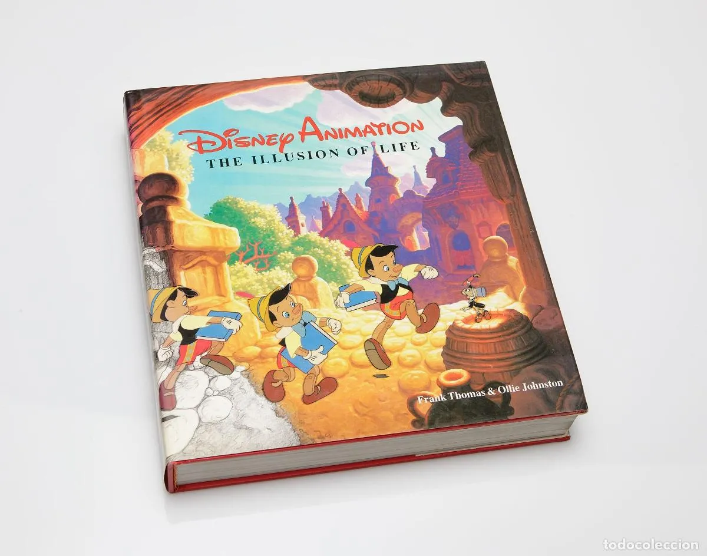
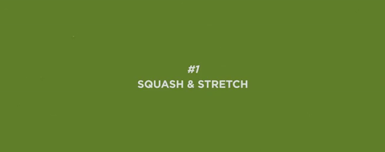
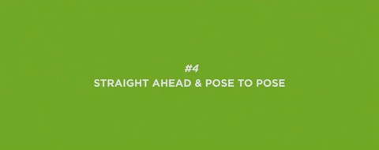
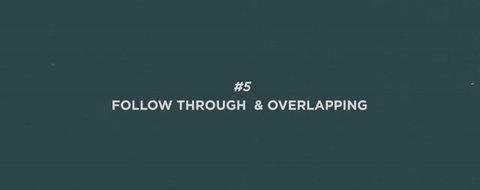
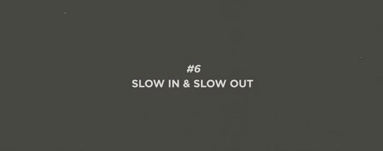
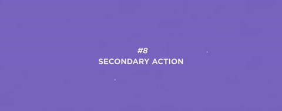
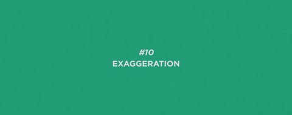
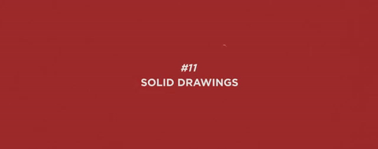
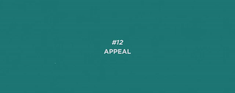

# 💃 Impacto de las animaciones en la UX
👋 Hola!! este **material** es para el [Live coding](https://www.youtube.com/live/rrYcZDZgqVc?feature=share) de **Garaje de ideas**.

## 🎁 Primera parte: Introducción a la animación web

### **💃 ¿Qué es una animación?**
### **🤔 ¿Por qué utilizar animaciones?**
### **🤓 ¿Cómo funcionan las animaciones en la web?**
### **🤩 ¿Cómo se crean las animaciones en la web?**

### **🥳 Los 12 principios de la animación**
Los llamados **«doce principios básicos de la animación»** fueron presentados en 1981 por los animadores Ollie Johnston y Frank Thomas de Walt Disney Animation Studio en su libro The Illusion of Life: Disney Animation basándose en el trabajo de los animadores de Disney desde 1930 en adelante.

<p align="center">
  
</p>

<p align="center">
  
</p>

### 🙆🏻‍♀️ 1. Estirar y encoger



### 🏃‍♀️ 2. Anticipación 


### 🎭 3. Puesta en escena 


### 🪅 4. Animación directa y pose a pose 



### 🎬 5. Acciones complementarias y superpuestas 



### 👀 6. Acelerar y desacelerar 



### 🌉 7. Arcos 


### 🎬 8. Acción secundaria 


### ⏰ 9. Sincronización 


### 🤣 10. Exageración 



### 🎨 11. Dibujo sólido 



### 💃 12. Atractivo 



### **🤷‍♀️ ¿Qué tipos de animaciones existen?**
Existen tres tipos de animaciones en la web:

- **Animaciones:**
- **Transiciones:** 
- **Transformaciones:** 
- **Interacciones y microinteracciones:** 

### **🍿 Formas de CSS para animar en la web**
Existen varias formas de animar elementos en la web:

- **Utilizando la propiedad animation de CSS**

- **Utilizando la propiedad transition de CSS**

- **Utilizando la propiedad transform de CSS:**


### **🤺 Animaciones CSS vs Transiciones CSS vs Transformaciones CSS**
1. Las **animaciones CSS** son secuencias de cambios de estilos que se aplican a un elemento en un intervalo de tiempo determinado.

2. Las **transiciones CSS** son cambios suaves de un estilo a otro.

3. Las **transformaciones CSS** son cambios que se aplican a elementos de HTML para modificar su forma, tamaño o posición.

## 🎥 Segunta parte: Animando con transiciones

### **🎳 Transiciones CSS**
Las **transiciones CSS**, por otro lado, son una forma más sencilla de crear animaciones que cambian gradualmente de un estado a otro. 

- La **interpolación** es el proceso de calcular los valores intermedios entre dos valores dados. Por ejemplo, podemos calcular el valor intermedio entre 0 y 100, que es 50.


Para crear una transición CSS, necesitamos utilizar las siguientes propiedades:

- **transition-property:** 

- **transition-duration:** 

- **transition-timing-function:** 

- **transition-delay:** 

```css
.transitioning {
  transition-property: background-color;
  transition-duration: 1s;
}

.transitioning:hover {
  background-color: red;
}
```


## 🎥 Tercera parte: Animando con CSS

### **🎞️ Animaciones CSS: @keyframes**

- **@keyframes:** esta regla permite definir las fases de la animación, especificando cómo debe cambiar el estilo de un elemento en diferentes puntos del tiempo.

```css
@keyframes nombreDeLaAnimacion {
  0% {
    /* estilos para el inicio de la animación */
  }
  100% {
    /* estilos para el final de la animación */
  }
}
```

También puedes definir múltiples puntos de tiempo con porcentajes intermedios:

```css
@keyframes nombreDeLaAnimacion {
  0% {
    /* estilos para el inicio de la animación */
  }
  50% {
    /* estilos para la mitad de la animación */
  }
  100% {
    /* estilos para el final de la animación */
  }
}
```


```css
.miElemento {
  animation: nombreDeLaAnimacion duracion tipoDeRepeticion tiempoDeRetraso;
}

/* Por ejemplo: */
.miElemento {
  animation: nombreDeLaAnimacion 5s linear 1s;
}
```


### **🦄 Animaciones CSS: propiedades**
Veamos en más detalle cómo crear una animación CSS. Para ello, vamos a utilizar las siguientes propiedades:

- **animation-name:**
- **animation-duration:** 
- **animation-timing-function:** 
- **animation-delay:**
- **animation-iteration-count:**
- **animation-direction:**
- **animation-fill-mode:**

Para **crear una animación en CSS**, debemos seguir estos pasos:

**Definir las fases de la animación utilizando la regla @keyframes**.

1.**Asignar un nombre a la animación utilizando la propiedad animation-name.** 

2.**Especificar la duración** de la animación utilizando la propiedad animation-duration.


**Aquí vemos un ejemplo** de cómo se podría crear una animación sencilla para hacer que un elemento parpadee:

```css
@keyframes blink {
  50% {
    opacity: 0;
  }
}

.blinking {
  animation-name: blink;
  animation-duration: 1s;
  animation-iteration-count: infinite;
}
```

### **🕰️ Animaciones CSS: duración**

Las funciones de tiempo en CSS **se utilizan para especificar el tiempo que debe transcurrir antes de que una animación o transición se complete**.

Existen varias funciones de tiempo que puedes utilizar en CSS:

- **transition-duration:** Establece la duración de una transición.
- **transition-delay:** Establece el retraso antes de que se inicie una transición.
- **animation-duration:** Establece la duración de una animación.
- **animation-delay:** Establece el retraso antes de que se inicie una animación.


```css
.mi-elemento {
  /* Establecemos una transición de 1 segundo */
  transition-duration: 1s;
  /* Establecemos un retraso de 0,5 segundos antes de que se inicie la transición */
  transition-delay: 0.5s;
  /* Establecemos una animación de 2 segundos */
  animation-duration: 2s;
  /* Establecemos un retraso de 1 segundo antes de que se inicie la animación */
  animation-delay: 1s;
}
```

### **🕰️ Animaciones CSS: timing functions**

> Nota: No existe una propiedad real llamada "timing-function". Cuando me refiero a esta "propiedad", en realidad me estoy refiriendo tanto a las propiedades transition-timing-function como animation-timing-function.

- **ease:** la animación comienza lentamente, acelera en el medio y termina lentamente.
- **linear:** la animación se reproduce de manera uniforme.
- **ease-in:** la animación comienza lentamente y acelera hacia el final.
- **ease-out:** la animación comienza rápidamente y se desacelera hacia el final.
- **ease-in-out:** la animación comienza lentamente, acelera en el medio y se desacelera hacia el final.
- **step-start:** la animación comienza de inmediato y luego se detiene en cada punto clave.
- **step-end:** la animación comienza de inmediato y luego se detiene en cada punto clave.
- **steps(n, start|end):** la animación comienza de inmediato y luego se detiene en cada punto clave. El primer parámetro especifica el número de pasos y el segundo parámetro especifica si la animación debe comenzar o terminar en cada punto clave.
- **cubic-bezier(n,n,n,n):** la animación se reproduce de acuerdo con una curva de Bézier personalizada. Los cuatro parámetros especifican los puntos de control de la curva.

Que es cubic-bezier? [Cubic-bezier](https://cubic-bezier.com/#.17,.67,.83,.67) es una función de tiempo que te permite crear una curva de Bézier personalizada. Una curva de Bézier es una curva matemática que se utiliza para crear transiciones suaves entre dos puntos. Puedes utilizar cubic-bezier para crear animaciones personalizadas.

Ejemplo con código CSS de una animación con diferentes funciones de tiempo:

```css
    animation-timing-function: ease;
    animation-timing-function: linear;
    animation-timing-function: ease-in;
    animation-timing-function: ease-out;
    animation-timing-function: ease-in-out;
    animation-timing-function: step-start;
    animation-timing-function: step-end;
    animation-timing-function: steps(4, end);
    animation-timing-function: cubic-bezier(0.1, 0.7, 1.0, 0.1);
```

### **🕰️ Animaciones CSS: delay**
La propiedad animation-delay permite especificar cuánto tiempo debe transcurrir antes de que comience una animación.

```css
.mi-elemento {
  animation-delay: 1s;
}
```

### **🕰️ Animaciones CSS: iteration count**
La propiedad animation-iteration-count permite especificar cuántas veces debe repetirse una animación.

```css
.mi-elemento {
  animation-iteration-count: 3;
}
```

### **🕰️ Animaciones CSS: direction**
La propiedad animation-direction permite especificar la dirección en la que debe reproducirse una animación.


```css
.mi-elemento {
  animation-direction: alternate;
}
```

### **🕰️ Animaciones CSS: fill mode**

```css
.mi-elemento {
  animation-fill-mode: forwards;
}
```

### **🕰️ Animaciones CSS: shorthand**
La propiedad animation es una propiedad abreviada que te permite establecer todas las propiedades de animación en una sola declaración.


```css
.mi-elemento {
  animation: 1s ease-in-out 2s infinite alternate;
}
```

[Scroll-driven Animations](https://scroll-driven-animations.style/#demos)

## 😎 Cuarta parte: Responsive y Performance

## 3. Animación Responsive y Accesibilidad

### 3.3. Consideraciones de accesibilidad en animaciones web

## 4. Herramientas y Librerías de Animación Web

### 4.1. GreenSock Animation Platform (GSAP)

```html
<!-- HTML -->
<script src="https://cdnjs.cloudflare.com/ajax/libs/gsap/3.9.1/gsap.min.js"></script>
<div id="example-gsap"></div>

<!-- CSS -->
<style>
#example-gsap {
  width: 100px;
  height: 100px;
  background-color: yellow;
}
</style>

<!-- JavaScript -->
<script>
gsap.to('#example-gsap', {
  duration: 1,
  x: 200,
  y: 200,
  scale: 2,
  rotation: 360,
  ease: 'bounce.out',
});
</script>
```

### 4.2. Anime.js

```html
<!-- HTML -->
<script src="https://cdnjs.cloudflare.com/ajax/libs/animejs/3.2.1/anime.min.js"></script>
<div id="example-anime"></div>

<!-- CSS -->
<style>
#example-anime {
  width: 100px;
  height: 100px;
  background-color: pink;
}
</style>

<!-- JavaScript -->
<script>
anime({
  targets: '#example-anime',
  translateX: 250,
  translateY: 250,
  scale: 2,
  rotate: '1turn',
  duration: 2000,
  easing: 'easeInOutQuad',
  loop: true,
});
</script>
```

### 4.3. Mo.js

```html
<!-- HTML -->
<script src="https://cdn.jsdelivr.net/npm/@mojs/core"></script>
<button id="example-mojs">Click me!</button>

<!-- JavaScript -->
<script>
const burst = new mojs.Burst({
  parent: '#example-mojs',
  radius: { 30: 90 },
  count: 20,
  children: {
    shape: 'cross',
    stroke: 'teal',
    strokeWidth: { 6: 0 },
    angle: { 360: 0 },
    radius: { 30: 5 },
    duration: 2000,
  },
});

document.getElementById('example-mojs').addEventListener('click', function () {
  burst.replay();
});
</script>
```

### 4.4. Lottie

```html
<!-- HTML -->
<script src="https://cdnjs.cloudflare.com/ajax/libs/lottie-web/5.7.14/lottie.min.js"></script>
<div id="example-lottie"></div>

<!-- JavaScript -->
<script>
const animation = lottie.loadAnimation({
  container: document.getElementById('example-lottie'),
  renderer: 'svg',
  loop: true,
  autoplay: true,
  path: 'path/to/animation.json', // Replace with the path to your Lottie animation file
});

// Optional: Control playback with buttons or other user interactions
document.getElementById('play').addEventListener('click', function () {
animation.play();
});

document.getElementById('pause').addEventListener('click', function () {
animation.pause();
});

document.getElementById('stop').addEventListener('click', function () {
animation.stop();
});
</script>
```

### 4.5. Comparación de herramientas y selección adecuada**

- GSAP: Robusto y versátil, ideal para proyectos grandes y complejos.
- Anime.js: Ligero y fácil de usar, adecuado para proyectos pequeños y medianos.
- Mo.js: Foco en animaciones interactivas y efectos visuales.
- Lottie: Para trabajar con animaciones vectoriales exportadas desde Adobe After Effects.

## 5. Práctica guiada: Creación de una animación simple

### 5.1. Definición del proyecto**

Crearemos una animación de un círculo que se mueve de izquierda a derecha y cambia de color al pasar el cursor sobre él.

### 5.2. Diseño de la animación**

- Objeto: Círculo
- Movimiento: De izquierda a derecha
- Interacción: Cambio de color al pasar el cursor

### 5.3. Implementación con HTML, CSS y JavaScript**

```html
<!-- HTML -->
<div id="circle" class="circle"></div>

<!-- CSS -->
<style>
.circle {
  width: 50px;
  height: 50px;
  border-radius: 50%;
  background-color: blue;
  position: absolute;
  left: 0;
  top: 50%;
  transform: translateY(-50%);
  transition: background-color 0.5s;
  animation: moveRight 3s linear infinite;
}

.circle:hover {
  background-color: red;
}

@keyframes moveRight {
  0% {
    left: 0;
  }
  100% {
    left: calc(100% - 50px);
  }
}
</style>
```

### 5.4. Ajustes responsives y accesibles

```css
@media (max-width: 480px) {
  .circle {
    width: 30px;
    height: 30px;
    animation-duration: 4s;
  }
}
```
### 5.5. Debugging y optimización

## 7. Recursos y consejos para seguir aprendiendo
### 7.1. Cursos y tutoriales recomendados

- CSS Animations and Transitions (MDN)
- GreenSock Animation Platform (GSAP) - Getting Started
- Anime.js - Documentation
- Mo.js - Getting Started
- Lottie - Official Documentation

### 7.2. Comunidades y foros para aprender y compartir conocimientos

- Stack Overflow
- Codepen.io
- Reddit - r/web_design
- Reddit - r/Frontend
- CSS-Tricks

### 7.3. Proyectos y desafíos para seguir practicando

- 100 Days CSS Challenge
- Daily UI Design Challenge
- Frontend Mentor

**Conclusión y cierre del taller**